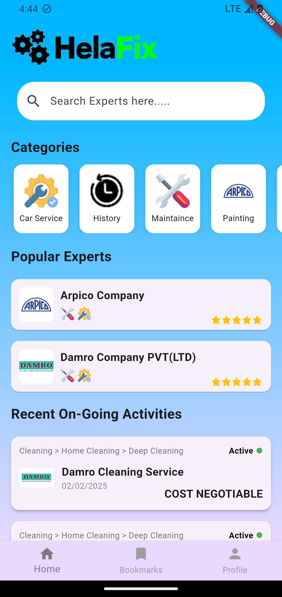

# 📱 HelaFix Mobile App

HelaFix is a mobile application designed to provide convenient and reliable repair and maintenance services for users in Sri Lanka. This repository contains the source code for the HelaFix mobile client.

## 🚀 Features

- 🔧 Browse and book repair services (AC, plumbing, electrical, etc.)
- 🧰 View technician profiles and service ratings
- 📍 Track service status and technician location
- 🔔 Real-time notifications and updates
- 💳 Secure payment integration
- 🌐 Multi-language support

## 🛠️ Tech Stack

- **Framework:** Flutter / React Native / Android (Kotlin/Java)  
- **Backend:** FireBase  
- **State Management:** Provider / Bloc / Redux / etc.  
- **Other Tools:** Firebase / Google Maps / Stripe / etc.

> Update this section to reflect your actual tech stack.

## 📸 Screenshots

| Home | Service Details | Booking |
|------|------------------|---------|
|  |  |  |


## 📦 Installation

1. **Clone the repository**
   ```bash
   git clone https://github.com/BinodPerera/HelaFix.git
